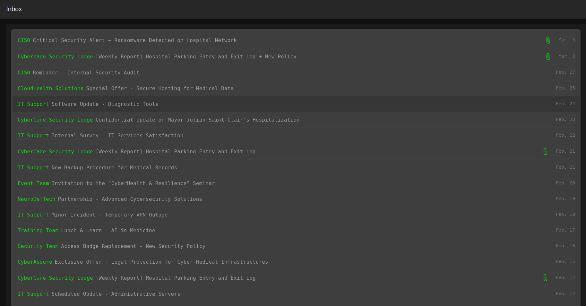
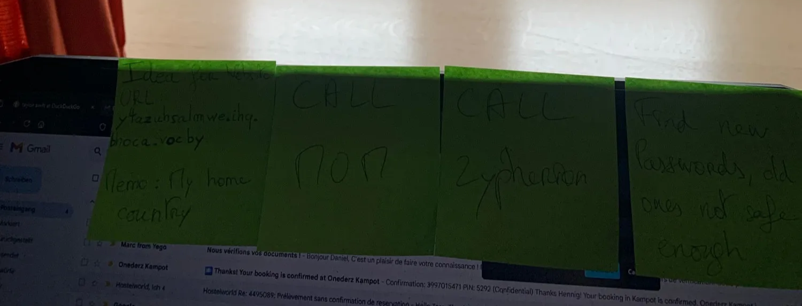
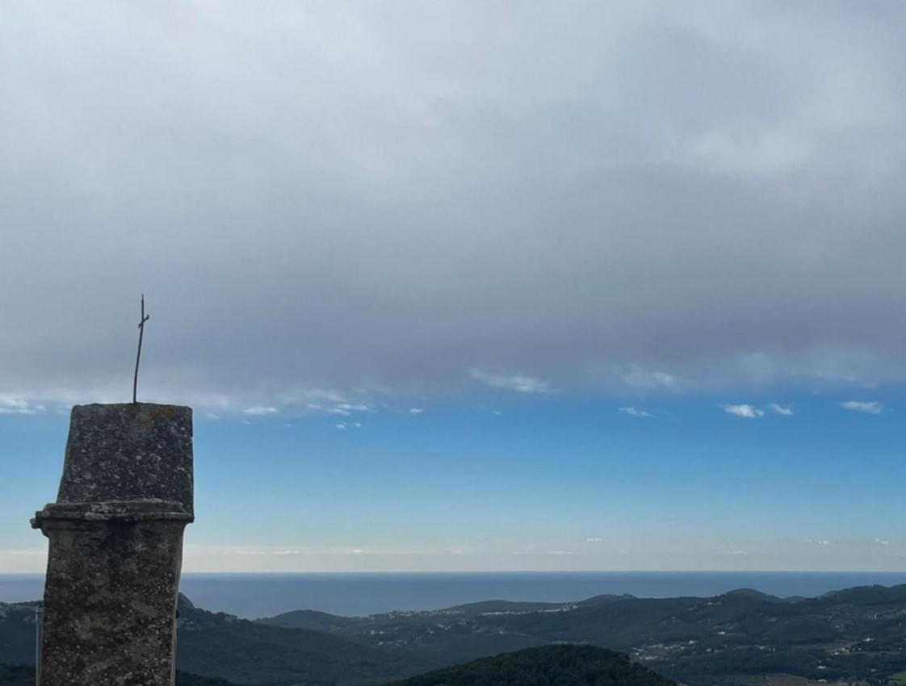

# Write-Up Hospital Ransomware

## Introduction

You can find below the write-up for Hospital Ransomware OSINT challenges of the 2025 Toulouse Hacking Convention. 

The challenge was split in 6 flags, of different difficulty. You will find each flag here as well as at least one technique to get to the flag. 

Thanks to everyone who participated, we hope that you enjoyed it as much as we did making it, and that you overcame every guessy or messy part with a smile. 

Let’s dive in:

## Step 1: Intrusion at THCity Hospital!

```markdown
You wake up this morning, called by the CISO of THCity Hospital, and check his 
emails. Trouble! Last night, the hospital was the victim of an attack, and 
ransomware was deployed on all the hospital's machines.Your goal now is to find 
out who could have done this, why, how, and where to find the criminals.

You need to find the most important files and find a clue as to the attacker's 
name!

Flag Format: THC{Name_Surname}. Example if the attacker is called 
"William Gibson" : THC{William_Gibson}

 https://thmail.ctf.thcon.party/      

Hints:
	The hacker probably came to the hospital...
	Visitors always seem to be linked to the patient they come to see       
```

The link leads to an email inbox created for the CTF:



The Hospital’s RSSI email Inbox

We have different informations here, including a multitude of fake tracks. 

Methodically, it is possible to first divide the email in two categories, with attached files and without.

Emails without attached files are mostly spam, nothing that seems to lead anywhere. There is one information that stands out and seems relevant, the mayor Julien Saint-Clair has been hospitalised and that information should stay strictly confidential, but this is not a suspicious name, it is the mayor. 

Emails with attached files are more interesting. There is weekly logs of the parking as well as a Critical Security Alert. - The hospital just got attacked so a first reflex would be to look at the security alert - 

There is a threatening audio messages and logs of the day of the attack. After going through the logs, one IP address as well as and unknown software stands out: 


But the IP is dull (completely legit website), and the software is unknown.

So there is only the entry and exit logs left. This is an excel of staff, hospitalised people as well as visitors. The flag asks for one person, so someone must stand out. Indeed every visitor visits someone of their family - or at least with the same last name - after grouping every file and filtering the excel for unique last name values, only one person is left: Zypherion Vexshade.

First flag: THC{Zypherion_Vexshade}

## Step 2: A strange man…

```markdown
That’s it! We have a name! Let’s dig deeper… It would be good to find
out if he acted alone or with others. 
Perhaps you can find the name or the pseudonym of one of his accomplices?

Flag Format: THC{@username} 
Example if the username is thegreatasparagus: THC{@thegreatasparagus}
```

A google search of “Zypherion Vexshade” leeds to these results: 


Google Search Zypherion Vexshade

his is a normal publication asking for writting tips, there is a comment of an account called @ZypherionVexshade: 


Zypherion Vexshade Comment

After translating from Mongolian (language detection on google translate for example), the result is: 

`Oh! Someone is writing a story under my real name! WTF trippy`

So this is the account of the real Zypherion Vexshade, it is confirmed. 

A faster way of finding this account would be to look for ZypherionVexshade on a website like instantusername.com, though this wouldn’t confirm that it is his real account instantly. 

Zypherion Vexshade gives his opinion on a multitude of subjects, gambling, MMA, Taylor Swift, movies etc… 


These posts are not so interesting. 

As usual, one reply stands out: 


ZypherionVexshade revealing himself

Could it be that ZyphiVexi is his usual @ on other social media?

On [instantusername.com](http://instantusername.com) it is possible to verify:

 for ZyphiVexi](src/image%206.png)

[istantusername.com](http://istantusername.com) for ZyphiVexi

Apparently that username is taken on Bluesky. 

Verification:


Zypherion Vexshade Bluesky

A multitude of posts again, more pictures this time and mainly more posts about gambling. But still it is the same subject and it seems to be the same person. He still is not very cautious.

After scrolling a bit there is two accounts that he tags: @riversidecasino and @zenMmth. 

Riversidecasino is a legit account of a casino. In his post with zenMmth he talks about a business meeting and a job he got from him. 


ZyphiVexi post with zenMmth

translation: 

`Recently, I had a great business meeting with my friend  @zenmmth.bsky.social at the Night City casino. We had a good conversation and he offered me a job. Good stuff.`

This creates a clear link between them. 

It is also in the cyberpunk theme. 

Flag of step 2: THC{`zenmmth.bsky.social`}

## Step 3: Is this secure?

```markdown
You find a strange man who seems to be close to the suspect. The suspect seems 
to have a website… Let’s find its URL ! It’s probably written somewhere…

Flag Format: THC{url} (note : there are the . in it) 
Example for http://d4rk.g@m3rz.xxs.thcity : THC{d4rk.g@m3rz.xxs.thcity}

Hints:
	Which cipher do you know that could use a key?
	Have you tried the vigenere code with an important county ?
```

Browsing through this new found Bluesky account and with the idea of looking for an url, one posted picture seems to be very meaningful. 



The post its give various informations, one of them being an “an idea for a website url”: y4azuhsalmwe.ihq.bhoca.vocby. Sadly, this url does not exist. 

Anyhow, there is a memo under the url, and in a recent bluesky post, zenMmth indicates that he recently found out about “Cesar Ciphers and all those things”. Applying Cesar cipher decryption to the url still doesn’t give anything interesting though. 

Ciphers similar to Cesar cipher and where a memo (probably indicating a passkey) is useful are not so many. One short pathed idea would be vigenere cipher. The home country of Zypherion and Zen can be deduced, they often post in mongolian and it is pretty rare that people speak mongolian for fun as a second language. Applying vigenere cipher with keyword “mongolia” outputs: m4mmothslair.ctf.thcon.party. A valid link!

Another way of finding the key would have been to deduce the end of the link (ctf.thcon.party) and retrieving the key by reversing from the ciphertext.

Flag Step 3: THC{`m4mmothslair.ctf.thcon.party`}

## Step 4: Sound Engineer

```markdown
You come across audio messages between Zen M4mmoth and his team. You 
then learn more about their plan. They nevertheless mention a secret 
hideout; you need to know where it is to catch their team!

Flag Format: THC{Lattitude_3_sig_figs-Longitude_3_sig_figs} 

Example for the french Point Zéro whose coordinates are 48.8534104,2.3481483 
would yield THC{48.853-2.348}

Hints:
	
	GeoMeet’s instructions state that the meeting point will be taken with the real-
	time locations of the 3 participants, where are they when the audios were 
	recorded ?
	
	Listen carefully, can’t you hear other voices or sounds in the background?
	
	You now have 3 locations, what can you do with it ?
	
	Have you thought about taking the center of this triangle ?
```

This link leads to an internet site:


And asks for a login and a password. As this is an OSINT challenge, it is possible to deduce these from informations gathered before. On the picture where the link was found, an open internet page is also on the screen. This internet page is open on gmail. Not having any other information a first try should be zenMmth@gmail.com. This is all we have.

For the password, as seen before both zen and zypherion love casino. In this case the password simply was “casino”.

SORRY: We admit that this part has been a bit guessy and very tricky to finish. Given the fact that there is not much more information, and that the site gives a hint on the password after three missed attempts, we thought that it would be possible to get through this challenge more easily, but we were wrong. As mentioned by some challengers, it was also possible to scrap the webpage and access the audios and files hidden behind the login without finding the credentials.

The internet site behind the login looks like this:


The audio messages are a conversation between the members of the crew that attacked the hospital, and the user guide is a notice on an application used to create a meeting point based on three points. So the goal is to find the three points that were used by the application to create their meeting point. 

On three of the vocal messages, there is a sound behind the person speaking. It is possible to isolate these sounds using software like Audacity for example. Once isolated the three sounds become more distinct:

- “Je suis devant le restaurant orgueil là, dans le onzième”, french for “I’m in front of the restauratn orgueil, in the 11th”. This references to the restaurant ‘orgueil’ in Paris at 6, Rue Popincourt. So the person is at that point. Cords: **48.85730142076398, 2.3776885110043615**

- “Estacion Venenta, Saouzelong”, occitan for “next station, saouzelong”. After finding out that this is occitan, it is easy to find that occitan is only spoken in the metro of Toulouse, and that Saouzelong is a metro station there. So the person is at the Saouzelong metro station in Toulouse. Coords: **43.579771626791825, 1.4594267703130572**

- “rouge et bleu sont nos couleurs, Lyonnais est notre coeur”. It can be tricky to hear, but once heard it is clear: this is the chant of Olympique Lyonnais, that they only sing so loudly in their stadium. The groupama stadium in Lyon. Coords: **45.76532913754116, 4.982083841563369**

Now, using the center of triangle tool from the website cachesleuth for example, it is possible to find the crew’s meeting point: 


Flag Step 4: THC{46.077-2.931} 

## Step 5: Vacation Hideout

```markdown
The SNAFU raided the location where soe intruders were but we did not find 
anything that could help.
Still we were able to get from the local authorities a message that was 
received a few hours ago in the vincinity and that reads :
    
"Hey there, I just arrived at the Var hideout and secured the location. 
Come quickly and try to be stealthy I don't want to get caught because of you ! 
There is no one here so we'll wait until things settle down. The chapel looks 
as weird as I remembered, look at this picture of the steeple."
 Ryker "Riot" Morales

Flag Format: THC{Lattitude_3_sig_figs-Longitude_3_sig_figs}

Example for the french Point Zéro whose coordinates are 
  48.8534104,2.3481483 would yield THC{48.853-2.348}
  
Hints:
	There can't be that many chapels in Var that have such a shape right?
```

With the following picture:



This is the last part of the classical Challenge, there should have been two main ways to solve it. Sadly the Overpass Turbo script doesn’t in this case because of Open Street Map wrong inputs. But it will probably work after corrections.

One another way is to simply input the image into google image search with the keywords “chapel” and “Var” 


After a little bit of scrolling, a very similar cross can be found on a chapel. Here on the bottom left. So it is the chapelle Notre-Dame du Beausset-Vieux (43.185, 5.805)

Flag step 5: THC{43.185, 5.805}

## Step 6 / Side Quest: Is that guy really just walking? (very hard)

```markdown
During your research on the hospital attacks, you might find other 
persons linked to the network. Can you find the username of the damaging
malware’s developer as well as the city he is living in so the Special 
Forces can ask him some questions?

Flag Format : THC{@username_City-Hyphen-Separated} 

For instance Aragorn living in Minas Tirith would yield THC{@aragorn_Minas-Tirith}
```

When browsing over ZypherionVexshade’s Bluesky account, it is possible to notice some alt text on specific pictures. One picture where Zypherion talks about an IT security conference can seem interesting in the context of the challenge. And indeed, in the alt text he decided to mention the person he was there with:


Indeed, thenetworkwalker is a user of Bluesky. 


NB: You can also find his account by typing "pandarmor" in the bluesky research bar. It's a bit of a far jump but given that the whole SOCINT challenge happens on Bluesky, this can be a used track at times.

This user posts in French and Italian, and has one specific post that reveals his identity and actions:


Pandarmor, the software used to attack the hospital, was developper by this user.

Now the goal is to find where he lives. He posts in french and italian, clearly is bilingual and has bilingual followers as he traduces his posts. On one picture, sensitive data can be found:


After translation: “Little walk in my village with a nice view, it is good to visit local monuments.”

The see can be seen in the back as well as a city with skyscrappers. He also mentions San Remo in one of his posts.

From this information, the network walking guy lives at the french-italian border, in a little village with a view on a city with skyscrappers. There is not so many cities with skyscrappers at the french italian border. Mainly with skyscrappers so close to the water. Three cities can be taken into account: Nice, Monaco and maybe Genova, even though it is already quite far from the border. 

He is also at a local monument. 

With three quick internet queries “Monument with view on Nice”, Monument with view on Monaco”, “Monument with view on Genova”, one stands out: the trophee d’auguste in La Turbie.

On street view: 


It is the place!

Flag step 6: THC{@thenetworkwalker_La-Turbie}
